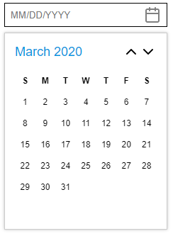

# datepicker-interface



A headless no-dependencies module for implementing Date Picker components.

* Bring in your own UI. Provides the logic for implementing a date picker.
* Provides support for selecting days, months, and years. 
* Supports internationalisation using [Intl](https://developer.mozilla.org/en-US/docs/Web/JavaScript/Reference/Global_Objects/Intl) browser API.
* Provides functionality to generate internationalised placeholders for input fields.
* Optional hooks for React and Preact for easier integration.
* Lightweight, no dependencies.

## Why should I use this?

I've noticed there was a severe lack of date pickers in the JavaScript ecosystem, and the ones available didn't meet my expectations. They either depended on unnecessary libraries (jQuery, moment, date-fns), had old-looking and unintuitive user interfaces, or were bloated because of all of the functionality they had. This library aims to be lightweight with no dependencies where you can bring in any UI you want.

## Getting Started

```
npm install datepicker-interface
```

Once installed, you can instantiate an instance of the interface that will keep track of the state:

```
import { createDatePickerInterface } from 'datepicker-interface';

let dpi = new DatePickerInterface();

// Then use the methods on the instance
dpi.getLayout();
```

You can also use the hook available for React or Preact:

```
import { useDatePickerInterface } from 'datepicker-interface/hooks/preact';

export default function DatePicker (props) {
    let dpi = useDatePickerInterface({
        onDateSelect: d => {
            props.onDateSelect(d);
        }
    });

    let layout = dpi.getLayout();

    return (
        <div class="DatePicker-calendar">
            <div class="DatePicker-calendar-header">
                <div class="DatePicker-calendar-title" onClick={dpi.goUpLevel}>
                    {layout.title}
                </div>
                <div class="DatePicker-calendar-arrows">
                    <span onClick={dpi.goPrevPage}>‹</span>
                    <span onClick={dpi.goNextPage}>›</span>
                </div>
            </div>
            <div class="DatePicker-calendar-body" key={layout.level}>
                {layout.grid.map(r => (
                    <div data-type={layout.level}>
                        {r.map(d => (
                            <div 
                                data-header={d.header}
                                onClick={!d.header && (() => dpi.select(d.value))}
                            >
                                {d.text}
                            </div>
                        ))}
                    </div>
                ))}
            </div>
        </div>
    );
}
```

For React, use ```datepicker-interface/hooks/react```.

## Options

The following options can be passed in when creating an instance of the interface:

***String* language** - The locale to use for the date picker. Default is browsers locale.
***Function* onDateSelect** - Receives the selected date as an argument when a day is selected.

## Methods

The following methods are exposed by DatePickerInterface:

***void* goUpLevel()**

The date picker starts with selecting the day, but you might want to go up a level and select the month, or go up again and select the year.

***void* goPrevPage()**

Go to the previous month, year or year range, depending on what level you are on.

***void* goNextPage()**

Go the next month, year or year range, depending on what level you are on.

***String* getFormattedDate(Date d)**

Return a localised date for the given date object.

***String* getPlaceholder()**

Return a placeholder string for the locale.

***void* select(Number v)**

If showing years, pass the selected year. This will cause the date picker to switch to showing months. If showing months, pass the selected month (0 index). This will cause the date picker to switch to showing days. If showing days, pass the selected day. This will trigger ```onDateSelect```. 

***Object* getLayout()**

Returns the current layout of the date picker. The object will contain ```level``` saying what type of data is being shown, ```title``` which will tell the user what the grid is containing and ```grid``` which contains a multi-dimensional array of objects containing ```text```, ```value``` and ```header```. Text contains the display text for the entry, value is the numerical value that can be passed into ```select```, and ```header``` will indicate if it's meant to be displayed as a header (ie. weekday headers).

## Examples

See ```examples``` directory for a working example. 
